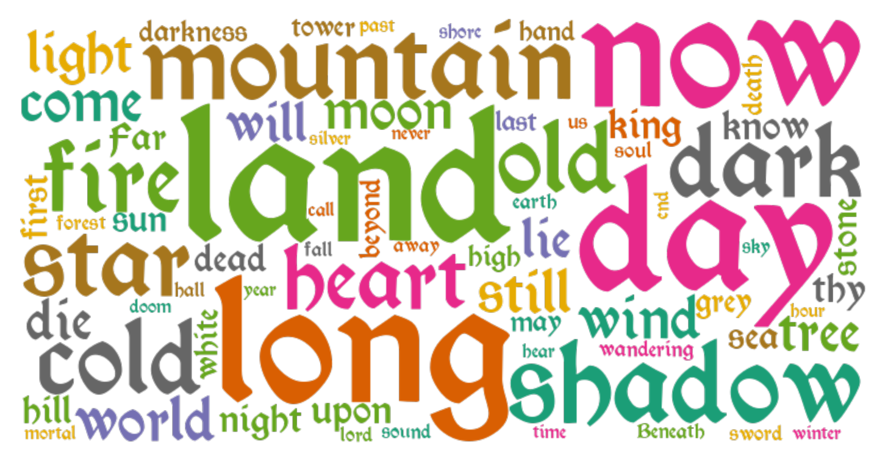

# Viz_of_Summoning_and_Middle_Earth 
This is a  project for PKU visualization summer school, processing text data of metal band Summoning and geo data of the middle earth to find hazy patterns and relationships between them.

## 1. What is Summoning?

**Summoning** is an Austrian epic/atmospheric black metal band, formed in 1993. Their style has been described as "Tolkien metal", because the lyrics of most of their songs deal with Middle-earth. 

It was part of the Austrian Black Metal Syndicate, along with [Abigor](https://www.metal-archives.com/bands/Abigor/1066) and [Golden Dawn](https://www.metal-archives.com/bands/Golden_Dawn/1425).

This is a wordcloud of Summoning's lyrics.

## 2. What is middle earth?

**Middle-earth** is the fictional setting the English writer [J. R. R. Tolkien](https://en.wikipedia.org/wiki/J._R._R._Tolkien "J. R. R. Tolkien")'s fantasy, which is the main continent of [Earth (Arda)](https://en.wikipedia.org/wiki/Arda_(Middle-earth) "Arda (Middle-earth)") in a certain time.

This is a timeline of Arda, and Tolkien's work is set in the First Age to the Third Age, and the most famous one, Lord of the Rings is in the Third Age.

It's only reasonable to visualize these place in the Third Age because [the Earth(Arda) had been flat before then](https://en.wikipedia.org/wiki/History_of_Arda).

## 3. What is Summoning's most mentioned place in middele earth?
Summoning's first three albums are named after strongholds of evil: "Lugburz" (1995), "Minas Morgul" (1996) and "Dol Guldur" (1996).

This map shows most mentioned place in their lyrics.

In detail, these maps show the lyric lines mentioning place.

## 4. Why did I make this project?
Under the cooperation with Mrs.Xiang and books written by Yi-Fu Tuan, I appreciate the attachment to place, and constantly find inspiration in cultural geography. From my perspective, place adds a nostalgic yet perceptible dimension to our life.
Trying to utilize what I learned in PKU viz summer school and link my geography-related background, I initially dived into CHGIS(Chines Historical GIS) data, and made a comparison of territorial changes between 1911 and 1926 by the intersection(a vector analysis tool) in QGIS. However, I realized the Chinese map is politically sensitive to post, before which I thought all coordinate reference systems are equal and only had geographical, instead of political, differences.

Suddenly I noticed the music playing in my earphone, it was Farewell by Summoning, which I'd been listening to while imagining the grandiose scenery and heroic wars in middle earth it portrayed for years and years. The solemn mountains, vast woods in ever-shadows, and rivers driving golden sunshine had become a place to escape from mundane toils for me.

Just like Arthur Rimbaud had never witnessed the ocean by the time he wrote the poem "The Drunken Boat", but still could narrate it magnificently, a fictional place could also be analyzed and visualized using tools known to deal with real-world data, which is my manifesto in this project.
## Data Source 

### Lyrics text data

”lyrics_for_wordcloud.txt“ is Summoning's all lyrics in their eight albums crawled from the [Metal Archives](https://www.metal-archives.com/bands/Summoning/29). 

To keep the accuracy in wordcloud, lyrics written in other languages are used in English translation, which includes the [Mirdautas Vras lyrics](https://www.metal-archives.com/albums/Summoning/Oath_Bound/108254) (in [neo-Black Speech](https://tolkiengateway.net/wiki/Black_Speech)) and [Evernight lyrics](https://www.metal-archives.com/albums/Summoning/Old_Mornings_Dawn/372416) in [Quenya](https://tolkiengateway.net/wiki/Quenya).

### Middle earth geo data

The DEM and vector shapefiles are from [Rose's GIS & Middle Earth Presentation & Data Set](https://scholarworks.wm.edu/asoer/3/), which is under [CC BY-NC-SA 4.0 License](https://creativecommons.org/licenses/by-nc-sa/4.0/), and my adaptions and share-alike methods are listed as follows:

DEM is directly added in QGIS with changes in its symbology to have better visual effects as a base layer. Since the DEM zip is too chunky to upload in GitHub, you can download them from the link above. To use my changes, upload "qgis_viz/DEM_style.qml" to "symbology" in QGIS.

Vector shapefiles are used and adapted in 3 steps:

1. Merging. I merged geographical features into one layer, and realms into one layer to have a more hierarchical and categorical comprehensive of this dataset. Their shapefiles are in "processed_geo_data/new_layers", with attribute table exported in "processed_geo_data/attribute_table"

2. Centorids. I used "centroids" and "add co-ordinate to points" tool in QGIS to the geo features in step 1, and exported them as "final_geo_data/poi_wgs84_with_xy.shp"

3. Concating/ VLOOKUP. To link middle earth place Summoning mentioned and source data, I tried pd.concat() and VLOOKUP(Excel function haha), and import them into QGIS using "Add Delimited Text Layer", and the result is "qgis_viz/poi_labeling.shp"

## Font declaration
The font used in wordcloud.ipynb is free of personal use, [downloaded from here](https://www.1001fonts.com/lord-of-the-rings-fonts.html?page=1).

## Reference

[What is summoning?](https://tolkiengateway.net/wiki/Summoning)

[pythonic-metal](https://github.com/ijmbarr/pythonic-metal)

[Middle earth](https://en.wikipedia.org/wiki/Middle-earth)

[Rose, Robert A. (2020) GIS & Middle Earth Presentation & Data Set. William & Mary.](https://doi.org/10.21220/RKEZ-X707)

## Also..

This pun lingers in my head for so long and I laugh every time when I listen to *Nightshade Forest* that I want to share it here haha.

